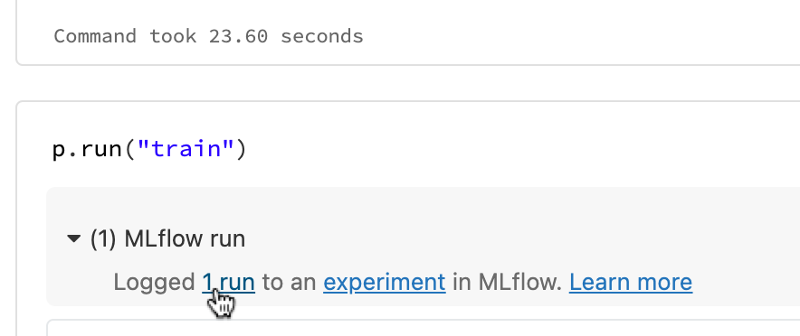

# Updating ML code in production

[(back to main README)](../README.md)

**NOTE**: This page assumes that your MLOps team has already configured CI/CD and deployed initial
ML resources, per the [MLOps setup guide](mlops-setup.md).

## Table of contents
* [Intro](#intro)
* [Opening a pull request](#opening-a-pull-request)
* [Viewing test status and debug logs](#viewing-test-status-and-debug-logs)
* [Merging your pull request](#merging-your-pull-request)
* [Next steps](#next-steps)

## Intro
After following the
[ML quickstart](ml-developer-guide-fs.md).
[ML quickstart](ml-developer-guide.md).
to iterate on ML code, the next step is to get
your updated code merged back into the repo for production use. This page walks you through the workflow
for doing so via a pull request.

## Opening a pull request

To push your updated ML code to production, [open a pull request](https://docs.github.com/en/pull-requests/collaborating-with-pull-requests/proposing-changes-to-your-work-with-pull-requests/creating-a-pull-request
https://learn.microsoft.com/en-us/azure/devops/repos/git/pull-requests?view=azure-devops&tabs=browser#create-a-pull-request
) against the remote Git repo containing the current project.

**NOTE**: the default tests provided in this repo require that you use a pull
request branch on the Git repo for the current project, rather than opening a pull request from a fork
of the Git repo. Support for running tests against pull requests from repo forks
is planned for the future.

## Viewing test status and debug logs
Opening a pull request will trigger a 
 
[workflow](../../.github/workflows/run-tests.yml) 
 
[Azure DevOps Pipeline](../../.azure/devops-pipelines/tests-ci.yml)
 
that runs unit and integration tests for the feature engineering and model training pipeline on Databricks against a test dataset.
You can view test status and debug logs from the pull request UI, and push new commits to your pull request branch
to address any test failures.

The integration test runs the feature engineering and model training notebooks as a multi-task Databricks Job in the staging workspace.
It reads input data, performs feature transforms, and writes outputs to Feature Store tables in the staging workspace. 
The model training notebook uses these Feature Store tables as inputs to train, validate and register a new model version in the model registry. 
The fitted model along with its metrics and params will also be logged to an MLflow run. 
To debug failed integration test runs, click into the Databricks job run
URL printed in the test logs. The job run page will contain a link to the MLflow model training run, which you can use
to view training metrics or fetch and debug the model as needed.

The integration test runs the model training notebook in the staging workspace, training, validating,
and registering a new model version in the model registry. The fitted model along with its metrics and params
will also be logged to an MLflow run. To debug failed integration test runs, click into the Databricks job run
URL printed in the test logs. The job run page will contain a link to the MLflow model training run:

Click the MLflow run link to view training metrics or fetch and debug the model as needed.



## Merging your pull request
Once tests pass on your pull request, get your pull request reviewed and approved by a teammate,
and then merge it into the upstream repo.

## Next Steps

After merging your pull request, subsequent runs of the feature engineering, model training and batch inference
jobs in staging will automatically use your updated ML code.

You may want to wait to confirm that
the staging jobs succeed, then repeat the workflow above to open a pull request against the
`{{cookiecutter.release_branch}}` branch to promote your ML code to production. Once your pull request against `{{cookiecutter.release_branch}}`
merges, production jobs will also automatically include your changes. 


After merging your pull request, subsequent runs of the model training and batch inference
jobs in staging and production will automatically use your updated ML code.


You can track the state of the ML pipelines for the current project from the MLflow registered model UI. Links:
* [Staging workspace registered model]({{cookiecutter.databricks_staging_workspace_host}}#mlflow/models/staging-{{cookiecutter.model_name}})
* [Prod workspace registered model]({{cookiecutter.databricks_prod_workspace_host}}#mlflow/models/prod-{{cookiecutter.model_name}})

In both the staging and prod workspaces, the MLflow registered model contains links to:
* The model versions produced through automated retraining
* The Git repository containing the ML code run in the training and inference pipelines
 * The recurring Feature Store jobs that computes and writes features to Feature Store tables.  
* The recurring training job that produces new model versions using the latest ML code and data
* The model deployment CD workflow that takes model versions produced by the training job and deploys them for inference
* The recurring batch inference job that uses the currently-deployed model version to score a dataset
